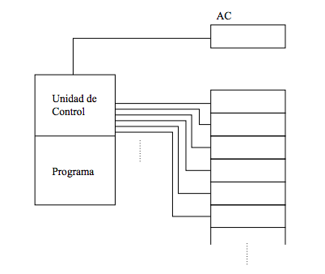

# Design and analysis of algorithms.
### Practice one: RAM Machine.

- - -

This is the first practice of the subject DAA, in this case we simulate the proper working order of Random Access Model in c++.

You can see other practices in [my gitHub Page.](http://alu0100288216.github.io)
